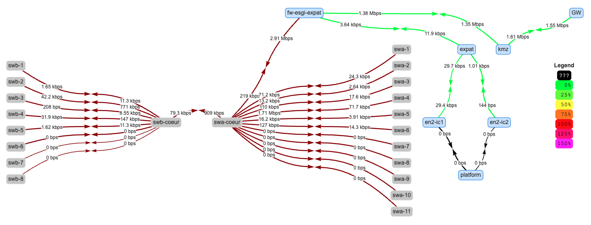

# Mindbreak CTF Infrastructure Overview

## What is Mindbreak?  
Mindbreak is a Capture The Flag (CTF) competition organized at ESGI, exclusively focused on cybersecurity challenges. Participants must solve various security-related tasks that test their technical skills, problem-solving abilities, and strategic thinking.

## Infrastructure and System Setup  
Our team is responsible for designing, deploying, and maintaining the network and server infrastructure that powers the competition. We ensure a stable, secure, and high-performance environment for all participants. Our key responsibilities include:

- **Network Architecture**: Designing and setting up the network to handle the competition’s traffic and security requirements.
- **Server Deployment**: Hosting and managing the challenges and competition platform.
- **Security Measures**: Implementing protections to ensure fairness and prevent abuse.
- **Monitoring & Maintenance**: Continuously supervising the infrastructure to ensure smooth operation during the event.

## Map of the Infrastructure

## Past and Future Editions  
- **Previous Editions**: We successfully managed the infrastructure for the first two editions of Mindbreak, progressively improving reliability and scalability.
- **Ongoing Work for the 3rd Edition**: Our team is currently working on further optimizations to enhance performance, security, and participant experience.
